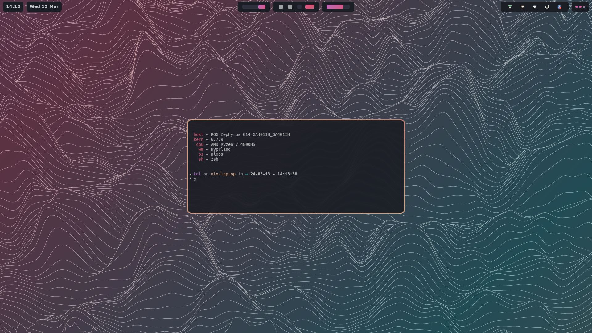
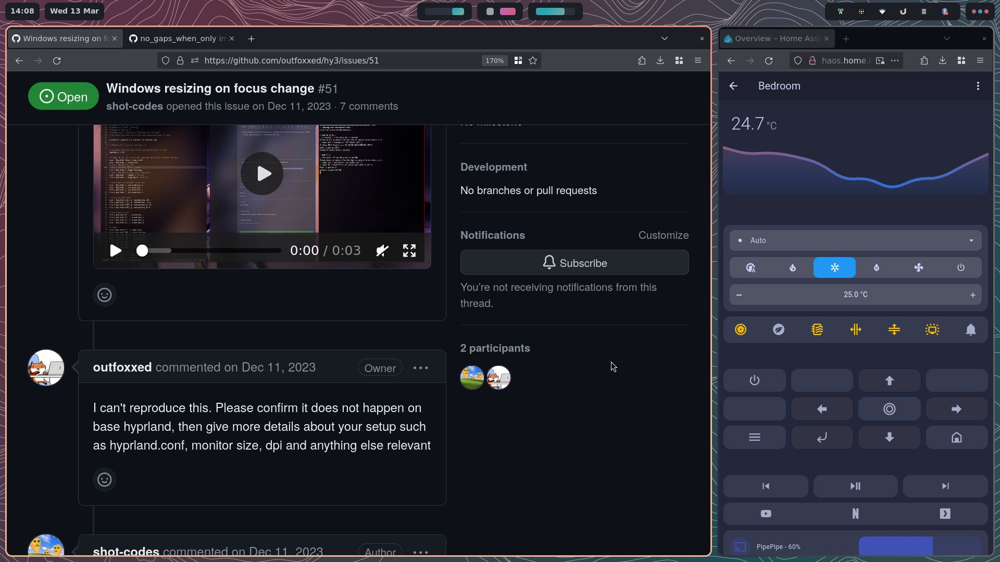
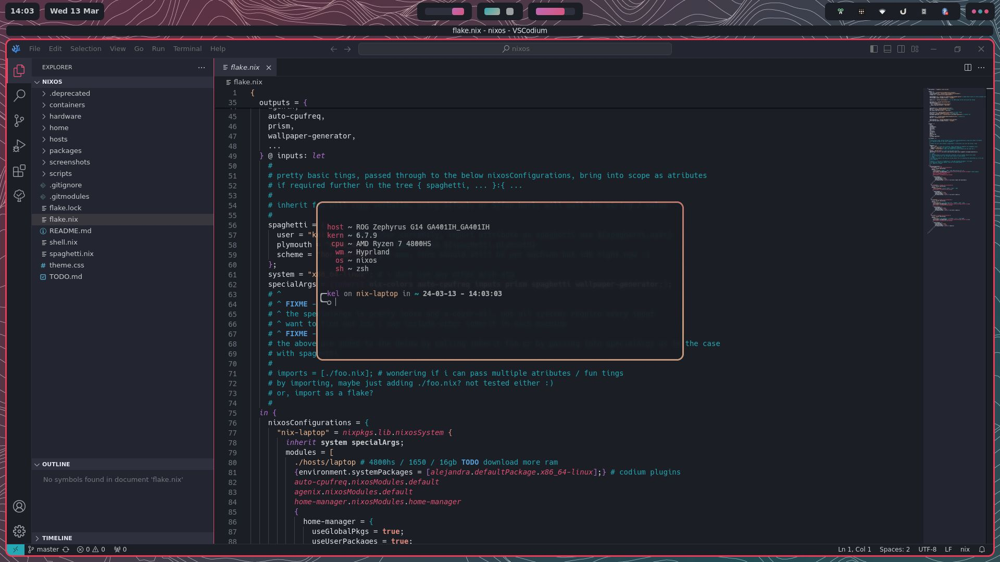

# 🍝 nixos

[](screenshots/1.jpg) 

my public nixos configuration, system specific configs for:

### desktop
13900kf - rtx 3070 - mostly un-used configs not up-to-date

### serv
9900k - file server, plex & misc services

### laptop
ga401ih - 4800hs - gtx 1650 - main pc

### notebook
cl10w-c - celeron? 4gb? 64gb? fun thing to toy with, reasonably capable considering it's age

### erying
erying Q1J2 - intel 1370p~ engineering sample - hosts many containers, sips power

### todo - nix-on-droid
pixel 7 pro - toying with the idea, lots to mess with - not in-tree

###  (づ ￣ ³￣)づ

## screenshots

 [](screenshots/2.jpg) 
 [](screenshots/3.jpg) 

current wip using ags, not complete by any standard


## included
see [standard.nix](hosts/standard.nix), [minimal.nix](hosts/minimal.nix) or [headless.nix](hosts/headless.nix) for base packages

in addition any of the hosts [default.nix](hosts/laptop/default.nix) for additional packages with configuration.
modules are having options (slowly) added, see [/home/hypr/default.nix](home/hypr/default.nix)

## about
programs in /home [home/pkgname](home/kitty/default.nix) have bindings, themes and exec at boot where applicable. add / remove in [hosts/hostname/default.nix](hosts/laptop/default.nix) FIXME these are changing as per above

some hypr keybind conflicts will apply if you are using multiple applications for the same purpose (wofi / ulauncher for example) I'll eventually add some options to (hopefully) avoid this.

username & plymouth theme configurable in flake.nix, see spaghetti

programs under [home](home/) come with nix-colors themes, change theme in [hosts/hostname/default.nix](hosts/laptop/default.nix) per system. TODO update this - not correct now :)

## use
clone this repository to your ~/

 ```cd ~ && git clone https://codeberg.org/kye/nixos```

copy contents of your /etc/nixos/hardware-configuration.nix and replace the contents of a hosts [hardware.nix](hosts/laptop/hardware.nix) of which you plan to use

open the root [flake.nix](flake.nix), change the ```user = "kel";``` line to your own username, this will change all home-manager and nixos config files; unless you too are kel

run ```sudo nixos-rebuild switch --flake /home/username/nixos#hostname --show-trace``` while changing username and hostname to what you have configured

things may / will fail, happy to helpout when my time permits
## issues

### ags
current configuration requires manual intervention, moving files from ~/nixos/home/ags/config to your ~/.config/ags/ dir

### secrets
secrets won't work out the box, quick workaround would be replacing my ~/nixos/secrets.json with ~/secrets.example/example.secrets.json

### home-manager
will complain about files in the way in your ```.config```, delete the files home-manager listed and run another rebuild