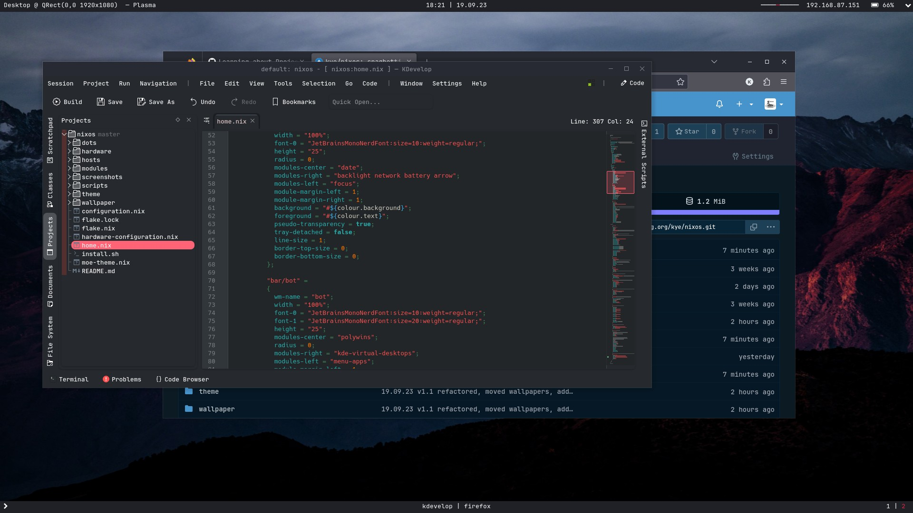
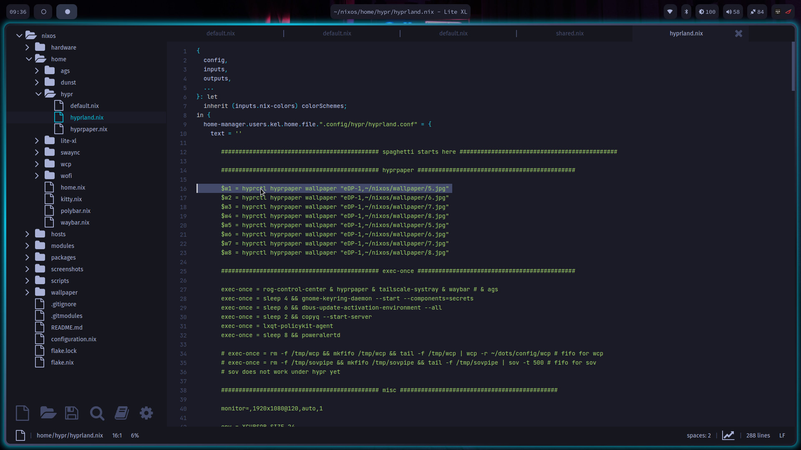

# nixos
> my public nixos configuration, system specific .nix for ga401 / desktop / cl10w-c

## about:
- programs are modular, ./home/<appname>/ will come with hypr keybindings and exec at boot where applicable. add remove in ./hosts/<hostname>/
- some binding conflicts will apply if you are using multiple launchers (wofi / ulauncher for example)
- username configurable in ./flake.nix for entire system
- programs under ./home/ come with nix-colors themes, change theme in ./hosts/hostname/default.nix for entire system
- 

## issues:
- is a wip, many things changing 
- wont ever be "complete"
- i update my flake weekly, compiling kernel / other packages can become frequent

## whats included:
- grub + gdm
- hyprland + hyprpaper
- xanmod kernel with questionable modules running on laptop
- zsh + ohmyzsh / foot + fish
- spaghetti
- a bunch of specific packages for my configuration / usecase
