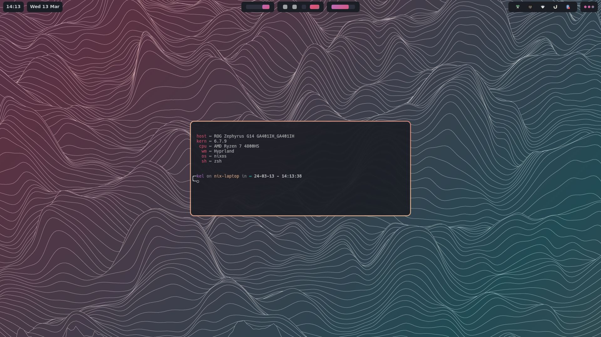
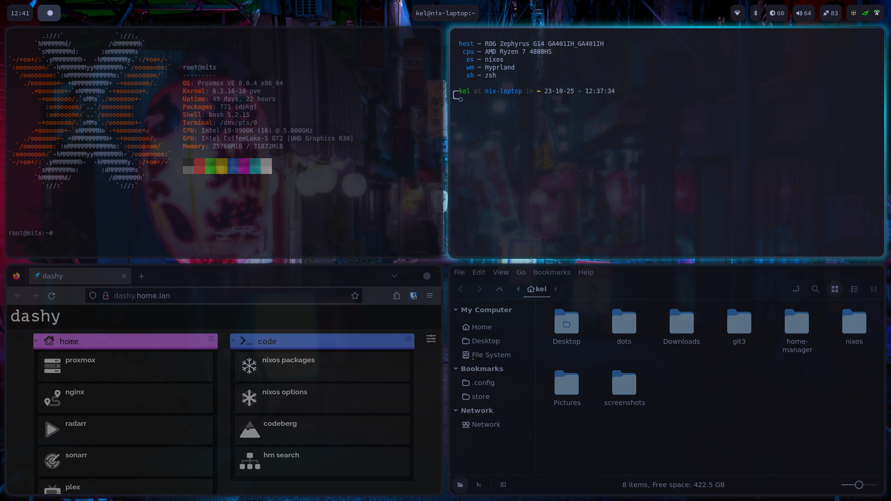

# 🍝 nixos
my public nixos configuration, system specific configs for ga401 / desktop / cl10w-c / erying Q1J2

 [](screenshots/1.jpg) 
 [](screenshots/2.jpg) 
 [](screenshots/3.jpg) 

current wip using ags, not complete by any standard


## included:
see [standard.nix](hosts/standard.nix), [minimal.nix](hosts/minimal.nix) or [headless.nix](hosts/headless.nix) for base packages

in addition any of the hosts ["default.nix"](hosts/laptop/default.nix) for additional packages with configuration.
modules are having options (slowly) added, see ["/home/hypr/default.nix"](home/hypr/default.nix)

## about:
programs in /home [home/pkgname](home/kitty/default.nix) have bindings, themes and exec at boot where applicable. add / remove in [hosts/hostname/default.nix](hosts/laptop/default.nix) FIXME these are changing as per above

some hypr keybind conflicts will apply if you are using multiple applications for the same purpose (wofi / ulauncher for example) I'll eventually add some options to (hopefully) avoid this.

username & plymouth theme configurable in flake.nix, see spaghetti

programs under [home](home/) come with nix-colors themes, change theme in [hosts/hostname/default.nix](hosts/laptop/default.nix) per system. TODO update this - not correct now :)

## use:
clone this repository to your /home/username/

 ```git clone https://codeberg.org/kye/nixos```

copy contents of your /etc/nixos/hardware-configuration.nix into a[hardware.nix](hosts/laptop/hardware.nix) of which host you plan to use

open the root [flake.nix](flake.nix), change the ```user = "kel";``` line to your own username, this will change all home-manager and nixos config files

run ```sudo nixos-rebuild switch --flake /home/username/nixos#hostname --show-trace``` while changing username and hostname to what you have configured

reboot the system and see what broke

## issues:

### home-manager -
it will complain about files in the way in your ```.config```, delete the files home-manager listed and run another rebuild


## tree:

```
~/nixos/.
├── README.md
├── containers
│   ├── authelia
│   │   └── default.nix
│   ├── blocky
│   │   └── default.nix
│   ├── codeproject
│   │   └── default.nix
│   ├── default.nix
│   ├── esphome
│   │   └── default.nix
│   ├── frigate
│   │   ├── README.md
│   │   ├── default.nix
│   │   └── igpu_stats.png
│   ├── home-assistant
│   │   └── default.nix
│   ├── invidious
│   │   └── default.nix
│   ├── nginx-proxy-manager
│   │   └── default.nix
│   ├── pihole
│   │   └── default.nix
│   ├── plex
│   │   └── default.nix
│   └── uptime-kuma
│       └── default.nix
├── flake.lock
├── flake.nix
├── gitcrypt.key
├── hardware
│   ├── audio
│   │   └── default.nix
│   ├── battery
│   │   └── default.nix
│   ├── bluetooth
│   │   └── default.nix
│   ├── coral
│   │   ├── default.nix
│   │   ├── libedgetpu-stddef.diff
│   │   └── libedgetpu.nix
│   ├── nvidia
│   │   └── default.nix
│   ├── rgb
│   │   └── default.nix
│   └── wireless
│       ├── iwd
│       │   └── default.nix
│       ├── nwm
│       │   └── default.nix
│       └── wpa
│           └── default.nix
├── home
│   ├── ags
│   │   ├── config
│   │   │   ├── config.js
│   │   │   ├── js
│   │   │   │   ├── bar
│   │   │   │   │   ├── main.js
│   │   │   │   │   └── widgets
│   │   │   │   │       ├── Clock.js
│   │   │   │   │       ├── Date.js
│   │   │   │   │       ├── Workspaces.js
│   │   │   │   │       ├── bat_level.js
│   │   │   │   │       ├── menu.js
│   │   │   │   │       ├── sys_tray.js
│   │   │   │   │       └── vol_level.js
│   │   │   │   ├── imports.js
│   │   │   │   ├── main.js
│   │   │   │   ├── misc
│   │   │   │   │   └── Separator.js
│   │   │   │   ├── utils.js
│   │   │   │   ├── variables.js
│   │   │   │   └── wallpaper.js
│   │   │   ├── reference.colours.css
│   │   │   └── style.css
│   │   └── default.nix
│   ├── asusctl
│   │   └── default.nix
│   ├── bottom
│   │   ├── bottom.toml.nix
│   │   └── default.nix
│   ├── codium
│   │   └── default.nix
│   ├── copyq
│   │   └── default.nix
│   ├── default.nix
│   ├── dunst
│   │   ├── config.nix
│   │   └── default.nix
│   ├── firefox
│   │   └── default.nix
│   ├── foot
│   │   └── default.nix
│   ├── gaming
│   │   └── default.nix
│   ├── git
│   │   └── default.nix
│   ├── greetd
│   │   └── default.nix
│   ├── gscreenshot
│   │   └── default.nix
│   ├── gtk
│   │   └── default.nix
│   ├── hypr
│   │   ├── config
│   │   │   └── main.conf
│   │   └── default.nix
│   ├── kde
│   │   └── default.nix
│   ├── kitty
│   │   └── default.nix
│   ├── lite-xl
│   │   ├── default.nix
│   │   ├── init.lua.nix
│   │   ├── nix.lua
│   │   └── theme.nix
│   ├── prism
│   │   ├── default.nix
│   │   ├── readme.MD
│   │   └── wallpapers
│   │       ├── 1.jpg
│   │       ├── 2.jpg
│   │       ├── 3.jpg
│   │       ├── 4.jpg
│   │       └── 5.png
│   ├── syncthing
│   │   └── default.nix
│   ├── tailscale
│   │   └── default.nix
│   ├── ulauncher
│   │   ├── Licence
│   │   ├── README.md
│   │   ├── default.nix
│   │   ├── manifest.json.nix
│   │   ├── theme-gtk-3.20.css.nix
│   │   └── theme.css.nix
│   ├── virt
│   │   └── default.nix
│   ├── vpn
│   │   └── default.nix
│   ├── waybar
│   │   ├── config.jsonc.nix
│   │   ├── default.nix
│   │   └── style.css.nix
│   ├── wofi
│   │   └── default.nix
│   └── zsh
│       ├── default.nix
│       └── theme.nix
├── hosts
│   ├── console.nix
│   ├── desktop
│   │   ├── boot.nix
│   │   ├── default.nix
│   │   ├── hardware.nix
│   │   └── per-device.nix
│   ├── erying
│   │   ├── boot.nix
│   │   ├── containers.nix
│   │   ├── default.nix
│   │   ├── hardware.nix
│   │   ├── net-test.nix
│   │   └── networking.nix
│   ├── headless.nix
│   ├── laptop
│   │   ├── boot.nix
│   │   ├── default.nix
│   │   ├── hardware.nix
│   │   └── per-device.nix
│   ├── minimal.nix
│   ├── mkOption.nix
│   ├── notebook
│   │   ├── default.nix
│   │   ├── hardware.nix
│   │   └── per-device.nix
│   ├── serv
│   │   ├── boot.nix
│   │   ├── containers.nix
│   │   ├── default.nix
│   │   ├── hardware.nix
│   │   └── networking.nix
│   └── standard.nix
├── nixos.code-workspace
├── packages
│   ├── image-colorizer
│   │   └── default.nix
│   ├── libfprint
│   │   └── default.nix
│   ├── shaderbg
│   │   └── default.nix
│   ├── shadow
│   │   └── default.nix
│   ├── sov
│   │   └── default.nix
│   ├── wallgen
│   │   └── default.nix
│   └── wcp
│       └── default.nix
├── screenshots
│   ├── 1.jpg
│   ├── 2.jpg
│   └── 3.jpg
├── scripts
│   ├── ags.sh
│   └── dunst
│       ├── asusctl.sh
│       ├── brightnessctl.sh
│       ├── hyprpicker.sh
│       └── pipewire.sh
├── secrets
│   └── secrets.json
├── serv
│   ├── arr
│   │   ├── default.nix
│   │   └── flood.nix
│   ├── caddy
│   │   └── default.nix
│   ├── changedetection
│   │   └── default.nix
│   ├── default.nix
│   ├── monitor
│   │   └── default.nix
│   └── nginx
│       └── default.nix
└── theme.css

81 directories, 145 files
```
