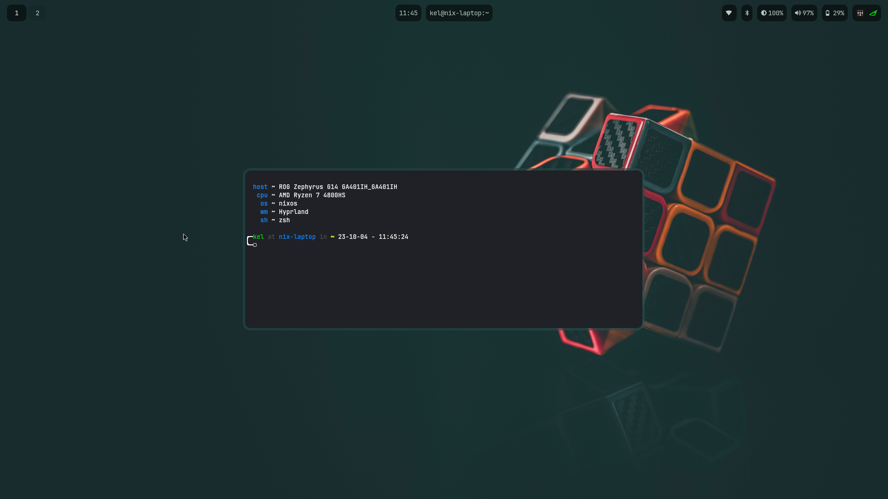

# nixos
 
> my public spaghetti nixos
> 
> system specific .nix for laptop ga401 / desktop

## issues:

dots are not included currently, waybar will run with default settings until that is resolved

desktop configuration is a wip, need to split out some nvidia hyprland config for that machine

## whats included:

- grub + gdm
- hyprland
- xanmod kernel with questionable modules running
- tailscale with tray icon
- steam
- zsh + ohmyzsh
- smartd drive monitoring via notifications
- kitty terminal
- spaghetti

## install:

`nix-shell -p git`

installs git, make sure you are in your home/user dir

`git clone https://codeberg.org/kye/nixos`

clones this git into the correct directory

`cp /etc/nixos/hardware-configuration.nix /home/username/nixos/`

copies your hardware configuration into the correct dir

change username in the configuration files (configuration, shared, flake and probs elsewhere :) )

`sudo nixos-rebuild switch --flake /home/username/nixos#nix-laptop --show-trace`

rebuilds the system with the new configuration

once installed you will need to `sudo rm -R boot/` then run `rebuild` or `sudo nixos-rebuild switch --flake /home/username/nixos#nix-laptop --show-trace` to get grub up and running

first install can take some time to build

## thanks to:

everyone who leaves snippets of code lying around the web
