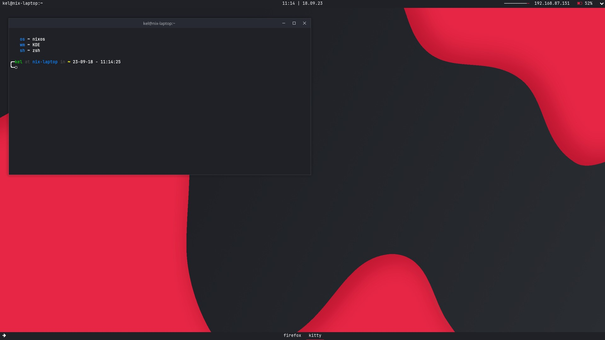

# nixos
 
> my public spaghetti nixos
> 
> system specific .nix for laptop ga401 / desktop

## issues:

theme in images is not included yet

these .nix are specific to my hardware configurations and may not work on your own system, feel free to use but YMMV

desktop has not been worked on, laptop has been the main focus of this git

## whats included:

- grub + lightdm with slick greeter
- declared kde (pending changes) + themes
- lightdm
- xanmod kernel
- tailscale with tray icon (pending changes)
- steam
- zsh + ohmyzsh
- smartd drive monitoring via notifications (pending changes)
- kitty terminal
- polybar with polywins

## install:

never made an install script before, current version is not working

main rundown is:

`nix-shell -p git`

installs git

`cd /home/username/`

change to your username

`git clone https://codeberg.org/kye/nixos`

clones this git into the correct directory

`cp /etc/nixos/hardware-configuration.nix /home/username/nixos/`

copies your hardware configuration into the correct dir

change username in the configuration files (configuration, shared, flake and probs elsewhere :) )

`sudo nixos-rebuild switch --flake /home/username/nixos#nix-laptop --show-trace`

rebuilds the system with the new configuration

once installed you will need to `sudo rm -R boot/` then run `rebuild` or `sudo nixos-rebuild switch --flake /home/username/nixos#nix-laptop --show-trace` to use lightdm / grub

first install can take some time to build
