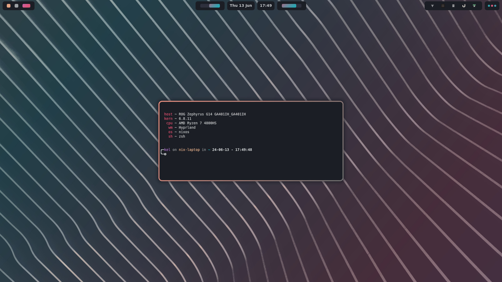
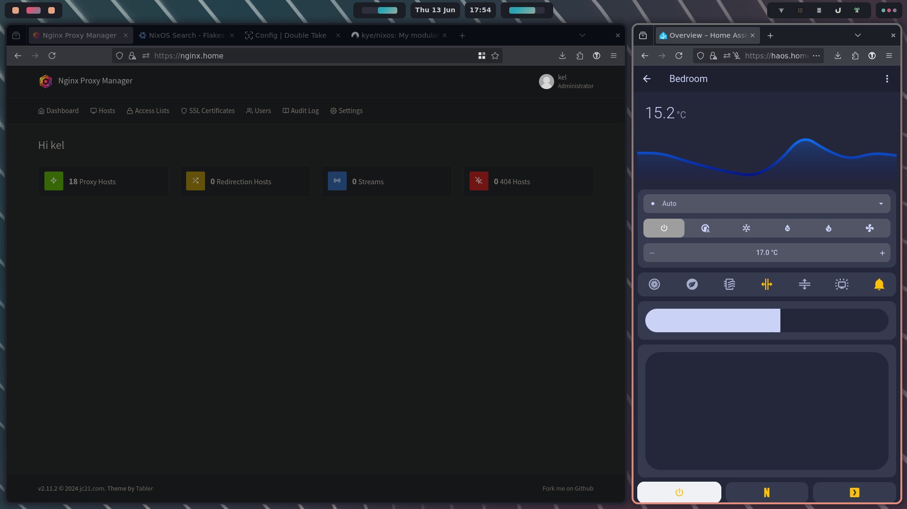
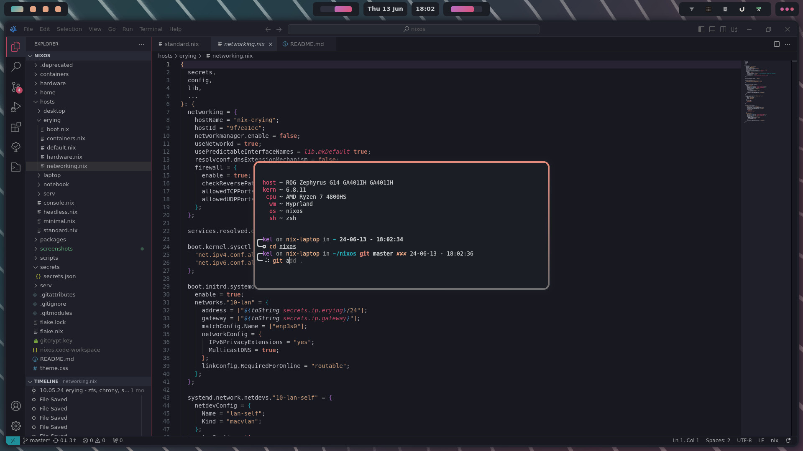

# 🍝 nixos
my public nixos configuration, system specific configs for ga401 / desktop / cl10w-c / erying Q1J2

 [](screenshots/1.jpg) 
 [](screenshots/2.jpg) 
 [](screenshots/3.jpg) 

current wip using ags, not complete by any standard


## included:
see [standard.nix](hosts/standard.nix), [minimal.nix](hosts/minimal.nix) or [headless.nix](hosts/headless.nix) for base packages

in addition any of the hosts ["default.nix"](hosts/laptop/default.nix) for additional packages with configuration.
modules are having options (slowly) added, see ["/home/hypr/default.nix"](home/hypr/default.nix)

## about:
programs in /home [home/pkgname](home/kitty/default.nix) have bindings, themes and exec at boot where applicable. add / remove in [hosts/hostname/default.nix](hosts/laptop/default.nix) FIXME these are changing as per above

some hypr keybind conflicts will apply if you are using multiple applications for the same purpose (wofi / ulauncher for example) I'll eventually add some options to (hopefully) avoid this.

username & plymouth theme configurable in flake.nix, see spaghetti

programs under [home](home/) come with nix-colors themes, change theme in [hosts/hostname/default.nix](hosts/laptop/default.nix) per system. TODO update this - not correct now :)

## use:
clone this repository to your /home/username/

 ```cd ~ && git clone https://codeberg.org/kye/nixos```

copy contents of your /etc/nixos/hardware-configuration.nix into a[hardware.nix](hosts/laptop/hardware.nix) of which host you plan to use

open the root [flake.nix](flake.nix), change the ```user = "kel";``` line to your own username, this will change all home-manager and nixos config files

run ```sudo nixos-rebuild switch --flake /home/username/nixos#hostname --show-trace``` while changing username and hostname to what you have configured

reboot the system and see what broke

## issues:

### home-manager -
it will complain about files in the way in your ```.config```, delete the files home-manager listed and run another rebuild